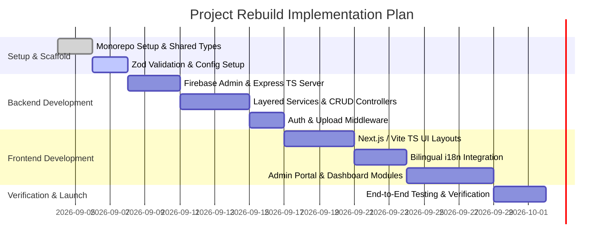

# System Architecture Blueprint: Sonarsiddha Agricultural Platform (Rebuild)

## 1. Executive Summary & Vision

The goal of this architectural rebuild is to transform the legacy Sonarsiddha codebase into a modern, production-grade, scalable, and maintainable full-stack application.

### Core Objectives
- **Type Safety & Reliability**: Full end-to-end TypeScript integration across frontend and backend.
- **Maintainable Layered Architecture**: Decouple business logic from HTTP handlers and UI components using Controller-Service-Repository pattern.
- **Robust Internationalization (i18n)**: Structured localized dictionary strategy for Marathi (`mr`) and English (`en`) rather than inline key mapping.
- **Enhanced Security & RBAC**: Enforce Role-Based Access Control (RBAC) for Admin functionality with secure token verification via Firebase Auth middleware.
- **Performant Data Fetching**: Implement Server-Side Rendering (SSR) / Static Site Generation (SSG) with client-side caching (TanStack Query) for lightning-fast page loads.

---

## 2. High-Level Architecture Diagram

```mermaid
graph TD
    subgraph Client Layer (Frontend)
        PublicWeb["Public Web Application (Marathi / English)"]
        AdminPortal["Admin Dashboard (RBAC Secured)"]
    end

    subgraph API & Middleware Layer (Backend)
        APIGateway["Express.js / Node.js API Gateway (TypeScript)"]
        AuthMiddleware["Firebase Auth & RBAC Middleware"]
        ValidationMiddleware["Zod Request Validation"]
    end

    subgraph Service & Business Logic Layer
        BranchService["Branch & Location Service"]
        ProductService["Product & Seed Service"]
        RatesService["Daily Market Rates Service"]
        ProfitService["Farmer Profit Calculator Service"]
        MediaService["Media & Upload Service"]
    end

    subgraph Data & Storage Layer
        Firestore["Firebase Firestore (Database)"]
        CloudStorage["Firebase Storage / Cloudflare R2 (Assets)"]
    end

    PublicWeb --> APIGateway
    AdminPortal --> AuthMiddleware --> APIGateway
    APIGateway --> ValidationMiddleware
    ValidationMiddleware --> BranchService & ProductService & RatesService & ProfitService & MediaService
    BranchService & ProductService & RatesService & ProfitService --> Firestore
    MediaService --> CloudStorage
```

---

## 3. Technology Stack Selection

| Layer | Recommended Technology | Justification |
| :--- | :--- | :--- |
| **Frontend Framework** | **Next.js 14+ (App Router)** or **React 19 + Vite** | Server Components for high SEO & performance; fast client rendering. |
| **Language** | **TypeScript** | Eliminates runtime errors and provides shared DTO contracts. |
| **Styling & UI** | **Tailwind CSS v4 + Shadcn UI** | Consistent design tokens, responsive layouts, and accessible UI components. |
| **State & Caching** | **TanStack Query (React Query v5)** | Automatic background refetching, caching, and optimistic UI updates. |
| **Localization (i18n)** | **next-intl** / **react-i18next** | Declarative key-based translation dictionaries (`mr.json`, `en.json`). |
| **Backend API** | **Express.js (TypeScript)** / **Next.js Route Handlers** | Clean modular routing, lightweight execution, and seamless middleware integration. |
| **Database** | **Firebase Firestore** (or **PostgreSQL with Prisma**) | Flexible document schema for content; scalable cloud infrastructure. |
| **Authentication** | **Firebase Auth (Custom Claims)** | Secure JWT tokens with verified Admin Role claims. |
| **Validation** | **Zod** | Schema validation for environment variables, API payloads, and form inputs. |

---

## 4. Repository Directory Structure (Monorepo Layout)

```
sonarsiddha-v2/
├── apps/
│   ├── web/                         # Frontend Application (React / Next.js)
│   │   ├── public/                  # Static assets & localized fallback JSONs
│   │   ├── src/
│   │   │   ├── app/                 # App Router pages & API routes
│   │   │   ├── components/          # Reusable UI & layout components
│   │   │   │   ├── ui/              # Primitive components (Button, Modal, Input)
│   │   │   │   ├── layout/          # Navbar, Footer, Sidebar
│   │   │   │   └── modules/         # Feature-specific widgets (RatesCard, ProfitCalc)
│   │   │   ├── hooks/               # Custom React hooks (useAuth, useRates)
│   │   │   ├── i18n/                # Translation dictionaries (mr.json, en.json)
│   │   │   ├── services/            # API client calls (Axios / Fetch wrappers)
│   │   │   └── store/               # Global state management
│   │   └── package.json
│   │
│   └── api/                         # Backend Application (Node.js / Express TS)
│       ├── src/
│       │   ├── config/              # Firebase Admin, Environment variables (Zod)
│       │   ├── controllers/         # HTTP Request Handlers
│       │   ├── middlewares/         # Auth, RBAC, Error Handler, Logger
│       │   ├── models/              # TypeScript Interfaces & Zod Schemas
│       │   ├── repositories/        # Database Access Layer (Firestore Queries)
│       │   ├── services/            # Core Business Logic Layer
│       │   ├── routes/              # Express API Route definitions
│       │   └── server.ts            # Entrypoint file
│       └── package.json
│
├── packages/
│   ├── shared-types/                # Shared DTOs and Data Interfaces
│   └── config/                      # Shared ESLint, Prettier, TypeScript configs
└── package.json
```

---

## 5. Database Schema & Data Modeling (Firestore)

### Collections Definition

#### 1. `branches`
```typescript
interface Branch {
  id: string;
  title: { mr: string; en: string };
  contactPerson: { mr: string; en: string };
  addressLines: { mr: string[]; en: string[] };
  phones: string[];
  type: 'national' | 'international' | 'main';
  createdAt: string; // ISO 8601
  updatedAt: string;
}
```

#### 2. `products`
```typescript
interface Product {
  id: string;
  name: { mr: string; en: string };
  description: { mr: string; en: string };
  category: 'seeds' | 'crop_protection' | 'fertilizer' | 'general';
  imageUrl: string;
  price?: number;
  specs: Record<string, string>;
  isAvailable: boolean;
  createdAt: string;
}
```

#### 3. `daily_rates`
```typescript
interface DailyRate {
  id: string;
  cropName: { mr: string; en: string }; // e.g. Shevga / Drumstick
  ratePerKg: number;
  marketLocation: string;
  date: string; // YYYY-MM-DD
  trend: 'up' | 'down' | 'stable';
  updatedAt: string;
}
```

#### 4. `farmer_profit_models`
```typescript
interface ProfitModel {
  id: string;
  landAreaAcres: number;
  estimatedInvestment: number;
  expectedYieldKg: number;
  avgMarketRatePerKg: number;
  expectedGrossIncome: number;
  expectedNetProfit: number;
  breakdownItems: Array<{
    category: { mr: string; en: string };
    cost: number;
  }>;
}
```

#### 5. `team_members`
```typescript
interface TeamMember {
  id: string;
  name: { mr: string; en: string };
  designation: { mr: string; en: string };
  photoUrl: string;
  phone?: string;
  order: number;
}
```

---

## 6. API Architecture & Standards

### Standardized API Response Format

All API endpoints must respond using a unified JSON contract:

```typescript
// Success Response
{
  "success": true,
  "data": { ... },
  "message": "Resource created successfully",
  "meta": {
    "timestamp": "2026-09-03T10:57:00Z"
  }
}

// Error Response
{
  "success": false,
  "error": {
    "code": "UNAUTHORIZED_ACCESS",
    "message": "Invalid authentication token provided",
    "details": []
  }
}
```

### Key API Routes Specification

| HTTP Method | Route | Auth Required | Description |
| :--- | :--- | :--- | :--- |
| `GET` | `/api/v1/public/navbar` | No | Fetch menu items & site metadata |
| `GET` | `/api/v1/public/branches` | No | Fetch active office branches |
| `GET` | `/api/v1/public/rates/latest` | No | Fetch today's crop market rates |
| `GET` | `/api/v1/public/profit-model` | No | Fetch profit & yield estimation formulas |
| `POST` | `/api/v1/admin/auth/login` | No | Authenticate admin credentials |
| `POST` | `/api/v1/admin/upload` | Yes (Admin) | Secure image/video upload to Cloud Storage |
| `POST / PUT / DELETE` | `/api/v1/admin/branches` | Yes (Admin) | Manage branch office listings |
| `POST / PUT / DELETE` | `/api/v1/admin/products` | Yes (Admin) | Manage seeds & products catalog |

---

## 7. Security, Performance & Deployment Strategy

### Security Standards
1. **Authentication Guard**: Verify Firebase ID tokens server-side using `firebase-admin/auth` and enforce Admin custom claim (`decodedToken.admin === true`).
2. **Input Validation**: Use **Zod** middleware to sanitize and validate all request parameters and body payloads prior to processing.
3. **CORS & Rate Limiting**: Enable strict origin white-listing (`cors`) and rate limiting (`express-rate-limit`) on public endpoints.

### Performance Optimization
1. **CDN Asset Distribution**: Serve images and static video assets via Google Cloud Storage CDN or Cloudflare R2.
2. **Optimized Image Formats**: Automatically compress uploaded user photos to WebP/AVIF formats.
3. **Caching Strategy**: Implement Stale-While-Revalidate (SWR) or React Query caching with 5-minute TTL on public rates and branch listings.

### Continuous Integration & Deployment (CI/CD)
- **Frontend Hosting**: Vercel / Firebase Hosting with automated PR previews.
- **Backend Service**: Cloud Run / Render / AWS ECS containerized via Docker.
- **Environment Management**: Validate environment variables at build-time using Zod schema (`env.mjs`).

---

## 8. Migration & Implementation Roadmap


