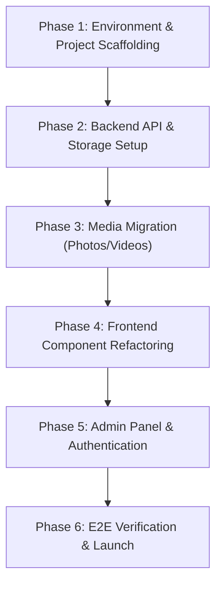

# Project Rebuild Implementation Plan (`implementation.md`)

## 1. Overview & Scope

This implementation plan details the step-by-step migration, refactoring, and reconstruction of the **Sonarsiddha (सोनारसिद्ध)** agricultural web application. It includes a complete catalog of all text contents (Marathi & English), asset photos/infographics, sample videos, database schemas, and feature modules.

---

## 2. Complete Asset & Media Inventory

### 📷 Photos & Graphic Assets
Located in `frontend/src/assets/` and `frontend/public/`:

| Asset Name | Relative Path | Purpose / Description |
| :--- | :--- | :--- |
| `logo.jpeg` | `src/assets/logo.jpeg` | Primary Sonarsiddha circular emblem / brand mark |
| `hero_mr.jpg` | `src/assets/hero_mr.jpg` | Marathi localized main banner image |
| `hero_en.jpg` | `src/assets/hero_en.jpg` | English localized main banner image |
| `image1.png` | `src/assets/image1.png` | About section farm background & showcase image |
| `image4_ai.jpg` | `src/assets/image4_ai.jpg` | Drumstick farm financial infographics & visual breakdown |
| `image5_ai.jpg` | `src/assets/image5_ai.jpg` | High-yield Shevga seed variety showcase |
| `image6_ai.jpg` | `public/image6_ai.jpg` | Drumstick harvesting process photo |
| `image7_ai.jpg` | `public/image7_ai.jpg` | Agricultural processing & packaging photo |
| `image8_ai.jpg` | `public/image8_ai.jpg` | Shevga pod quality inspection photo |
| `image9_ai.jpg` | `public/image9_ai.jpg` | Farm facility & storage unit photo |
| `shevga_drumsticks.jpg` | `src/assets/shevga_drumsticks.jpg` | Product detail image for drumsticks |
| `shevga_vertical.jpg` | `src/assets/shevga_vertical.jpg` | Vertical layout Shevga crop image |
| `image11.jpeg` - `image27.jpeg` | `src/assets/` | Photo gallery items (Farm visits, team members, branches) |

---

### 🎥 Video Assets
Located in `frontend/public/video/`:

| Video File | Format | Duration/Type | Embedded Section |
| :--- | :--- | :--- | :--- |
| `video1.mp4` | MP4 (H.264) | Local Demonstration | Farming guidance & Shevga planting intro |
| `video2.mp4` | MP4 (H.264) | Local Demonstration | Soil preparation & organic fertilizer guide |
| `video3.mp4` | MP4 (H.264) | Local Demonstration | Pruning technique & flower care |
| `video4.mp4` | MP4 (H.264) | Local Demonstration | Pod harvesting & sorting process |
| `video5.mp4` | MP4 (H.264) | Local Demonstration | Farmer success story & interview |

---

## 3. Bilingual Text & Content Data Catalog

### 🅰️ Navbar Menu Items
```json
[
  { "id": 1, "nameEn": "Home", "nameMr": "मुखपृष्ठ", "path": "/" },
  { "id": 2, "nameEn": "About", "nameMr": "आमच्याबद्दल", "path": "/about" },
  { "id": 3, "nameEn": "Farmer", "nameMr": "शेतकरी", "path": "/farmer" },
  { "id": 4, "nameEn": "Farmer Details", "nameMr": "शेतकरी माहिती", "path": "/farmer-details" },
  { "id": 5, "nameEn": "Gallery", "nameMr": "गॅलरी", "path": "/gallery" }
]
```

### 🅱️ About Section Content
- **Heading (MR)**: `"आमच्याबद्दल - शेतकऱ्यांच्या प्रगतीचा खरा साथीदार"`
- **Heading (EN)**: `"About Us - A True Companion in Farmers Progress"`
- **Quote (MR)**: `'"आम्ही शेतकऱ्यांचे सक्षमीकरण करण्यासाठी आणि आधुनिक तंत्रज्ञानासह शेतीमध्ये प्रगती घडवून आणण्यासाठी कटिबद्ध आहोत. उच्च दर्जाची कृषी उत्पादने, खते आणि मार्गदर्शन प्रदान करणे हे आमचे प्रमुख ध्येय आहे."'`
- **Quote (EN)**: `'"We are dedicated to empowering farmers and driving progress in agriculture with modern technology. Our goal is to provide high-quality agricultural products, fertilizers, and guidance."'`
- **Taglines**: `"सोनारसिद्ध - शेतकऱ्यांचा साथीदार"` / `"SONARSIDDHA - FARMER'S COMPANION"`

### 🅯 Farmer Profit Calculations (1 Acre Shevga)
```json
{
  "totalAmount": 45000,
  "totalLabelMr": "एकूण अंदाजे खर्च",
  "totalLabelEn": "Total Estimated Expense",
  "expenses": [
    {
      "id": "exp1",
      "icon": "🌱",
      "nameMr": "रोपटी / बी-बियाणे खर्च",
      "nameEn": "Sapling / Seed Cost",
      "amount": 15000
    },
    {
      "id": "exp2",
      "icon": "🚜",
      "nameMr": "नांगरणी व जमीन तयारी",
      "nameEn": "Ploughing & Soil Prep",
      "amount": 8000
    },
    {
      "id": "exp3",
      "icon": "💧",
      "nameMr": "ठिबक सिंचन व खते",
      "nameEn": "Drip Irrigation & Fertilizers",
      "amount": 12000
    },
    {
      "id": "exp4",
      "icon": "👨‍🌾",
      "nameMr": "मजुरी व फवारणी खर्च",
      "nameEn": "Labor & Spraying Cost",
      "amount": 10000
    }
  ]
}
```

---

## 4. Execution & Rebuild Phases



### Phase 1: Environment & Project Scaffolding
1. Initialize monorepo directory layout (`apps/web`, `apps/api`, `packages/shared-types`).
2. Configure **TypeScript**, **ESLint**, **Prettier**, and **Tailwind CSS v4**.
3. Create `shared-types` package with DTO interfaces for `Branch`, `Product`, `DailyRate`, `ProfitModel`, `TeamMember`, and `Video`.

### Phase 2: Backend API & Storage Setup
1. Refactor Express backend to TypeScript using controller-service-repository pattern.
2. Setup **Firebase Admin SDK** connection with verified service account keys.
3. Build generic Zod validation middleware for POST/PUT requests.
4. Implement secure file upload handler `/api/v1/upload` for Cloud Storage.

### Phase 3: Media Migration Pipeline
1. Verify and optimize image assets (`image1.png`, `image4_ai.jpg`, `logo.jpeg`) into WebP format.
2. Store local sample MP4 videos (`video1.mp4` through `video5.mp4`) in `public/video/` directory and configure stream headers.
3. Seed YouTube video metadata into Firestore collection `youtube`.

### Phase 4: Frontend Component Refactoring
1. Rebuild UI with React 19 / Next.js App Router and TypeScript.
2. Implement declarative i18n dictionaries (`mr.json`, `en.json`) to eliminate hardcoded text.
3. Reconstruct public pages:
   - `Home.jsx` with responsive Hero Banner switcher (`hero_mr.jpg` / `hero_en.jpg`).
   - `About.jsx` with logo overlays and quote section.
   - `FarmerProfit.jsx` with Recharts / interactive cards for income vs expense.
   - `YoutubeVideos.jsx` with horizontal video slider supporting both embedded YouTube IFrames and local HTML5 `<video>` tags.

### Phase 5: Admin Panel & CRUD Modules
1. Rebuild `Login.jsx` using Firebase Auth token authentication and custom admin claim verification.
2. Reconstruct `AdminLayout.jsx` with responsive sidebar navigation.
3. Implement interactive CRUD modal forms for:
   - **Branches**: Manage office titles, addresses, and phone contacts.
   - **Products**: Manage seeds catalog, prices, and specs.
   - **Daily Rates**: Update crop market prices per kg.
   - **Farmer Profit**: Edit per-acre expense breakdown items.

### Phase 6: Automated Testing & Verification
1. Run automated build checks (`npm run build` on frontend & backend).
2. Execute unit tests for API endpoints.
3. Verify public page rendering, language toggling, video playback, and admin CRUD workflows.

---

## 5. Verification & Acceptance Checklist

- [ ] All photos (`image1.png`, `image4_ai.jpg`, `logo.jpeg`, `hero_mr.jpg`, `hero_en.jpg`) render cleanly without 404 errors.
- [ ] All sample videos (`video1.mp4` to `video5.mp4`) play smoothly with HTML5 controls.
- [ ] Toggle between Marathi (`mr`) and English (`en`) translates all UI elements dynamically.
- [ ] Admin login authenticates securely via Firebase Auth.
- [ ] CRUD operations on Branches, Products, Daily Rates, and Profit items update Firestore documents in real time.
